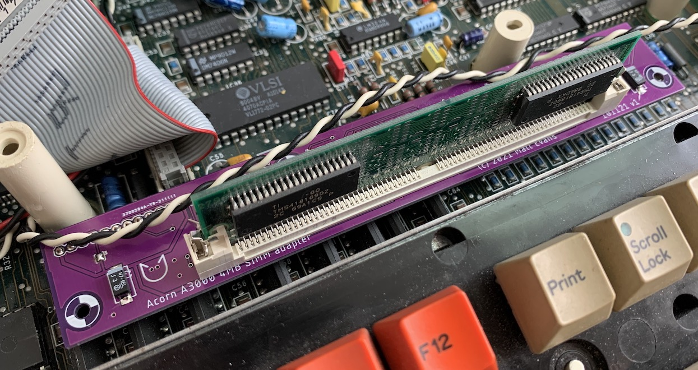

# Acorn A3000 4MB SIMM adapter board

25 Nov 2021

This board allows an Acorn A3000 computer to be upgraded to 4MB of RAM using a (still) common 4MB 72-pin SIMM.

Designed in Eagle.  Schematic [here](doc/simm_adapter_schematic.pdf), board layout [here](doc/simm_adapter_board.pdf).

Snazzy purple PCB c/o JLCPCB's 2-layer PCB service.

## SIMM compatibility

SIMMs are constructed with one bank (RAS0/RAS2 strobes) or two banks (RAS0-RAS3 strobes).

You will require a non-parity FPM or EDO 4MB SIMM with *one* bank.  Speed shouldn't matter, 70ns is fine.

Tested with a SIMM containing 2x TMS418169DZ 60ns EDO parts.

Ideally, look out for a SIMM with two chips, on one side.  Typically two-bank SIMMs have chips on both sides (but this is just a rule of thumb).

Because the unused RAS1/RAS3 strobes are tied inactive, you may find an 8MB dual-bank SIMM can be used with one (4MB) bank active, but this has not been tested.  A parity SIMM should also work (though the parity data lines are floating, which might not be great).  Again, untested.

Also, try to find a SIMM as short as possible, to avoid crashing into the case.  In extreme cases, the long pin headers on the A3000 motherboard could be trimmed or replaced...

## Construction

You will need:

   * 3x 0.1" 1x20 pin header sockets
   * 1x 72 pin vertical SIMM socket, such as a _TE Connectivity 5822021-4_
   * 2x Tantalum/SMT electrolytic capacitors.  Exact value isn't too important*.  10uF, 47uF, something like that. 

*: I noticed my SIMM doesn't have any decoupling on it whatsoever (but has footprints).  Cheeep.  You might want to add some more caps in the 0.1-1uF range, if this is the case.

A hole is provided in the middle for a bracket (not provided) that can attach to the nearby motherboard mounting hole, for stability.

## Licence

No warranty is provided, and this work is used at your own risk.  

Licenced as CC BY-SA 3.0

Copyright 2021 Matt Evans

